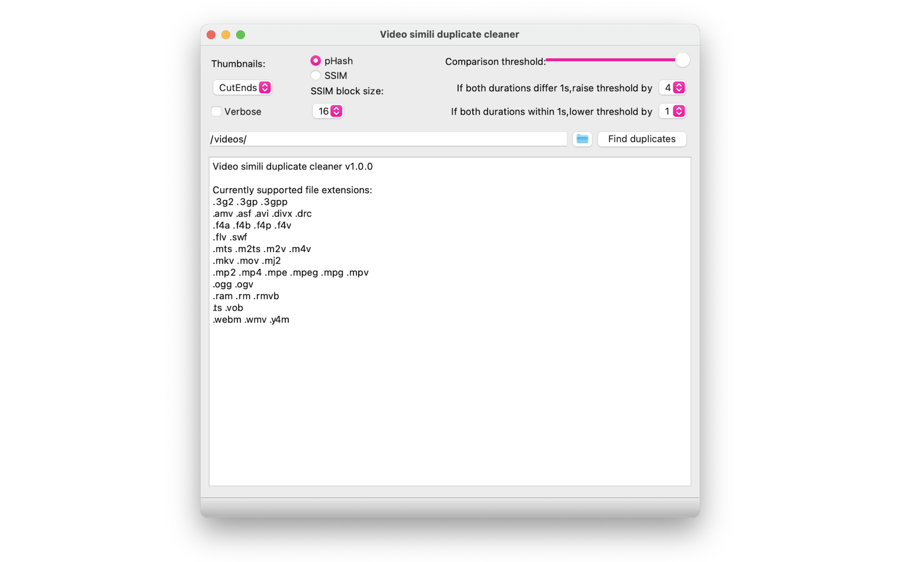

# Video simili duplicate cleaner

Find and remove duplicates : *Video simili duplicate cleaner* is a program that can find duplicate or simply similar video files.
Video simili duplicate cleaner compares the actual video content regardless of different format or compression used, while other software only find identical files (digital video fingerprinting).

This app is [made available via the App Store with a small cost](https://apps.apple.com/us/app/video-simili-duplicate-cleaner/id1557271308), in order to support further development work. You are of course free to check out the source code on GitHub, report bugs, suggest new features, and contribute code ! But please support my work via the App Store purchase, and do not redistribute the binary, although of course you may use the code for you own projects, no problemo !

You can also support the project, or specific issues, via [BOUNTYSOURCE](https://www.bountysource.com/teams/video-simili-duplicate-cleaner/issues). You can make donations for the project, or post a bounty as a "reward when a specific issue is completed". This helps identify which issues are important and should be done first.

## Contact

Want to report a bug 🐞, suggest new ideas 💡, give general feedback 🧐 or have some specific question 🙋 ? That's what our [DISCUSSIONS PAGE](https://github.com/theophanemayaud/video-simili-duplicate-cleaner/discussions) is for 🚀 [Issues](https://github.com/theophanemayaud/video-simili-duplicate-cleaner/issues) can also be used for bugs 🪳 and feature  suggestions, but it's often good to first chat about them in the discussions 💬.

## Examples

In the samples folder, you will find two videos with different sizes and compression levels, which result in the following two windows of the app :

## Features

- Simple, easy to use graphical user interface for comparing videos.
- Supports all widely used video formats.
- Manually select videos to remove, or use automatic selection criteria.
- Safely move duplicates to trash (you must empty your trash afterwards to really delete the videos), or to a folder of your choosing. 
- Specify locked folder, to make sure the videos within are never moved. 
- Multithreaded operation, makes full use of all available CPU threads.
- Employs two powerful image comparison methods: pHash (perceptual hashing) and SSIM (structural similarity).
- Uses caching for blazing fast second runs.
- macOS: supports Apple Photos, to save more space. 
- Cross-platform and open source development: source code available for compiling on Windows/Linux/macOS.

## Changelog

See [CHANGELOG.md](CHANGELOG.md) file.

## Roadmap

To see what is wanted and planned, see the [Project Roadmap 🗺 page](https://github.com/theophanemayaud/video-simili-duplicate-cleaner/projects/1). These things may or may not happen, in no guaranteed time frame ⏳. You can suggest ideas 💡 on [the project's github issues page](https://github.com/theophanemayaud/video-simili-duplicate-cleaner/issues) or our [DISCUSSIONS 💬 PAGE](https://github.com/theophanemayaud/video-simili-duplicate-cleaner/discussions).

## Usage
 
### Main window

After starting the program you must enter which folders to scan for video files. Folders can be added by typing them in, dragging and dropping a folder onto the window or using the folder browser button next to the input box. On macOS, you can add Apple Photos library(ies) to the search by using the dedicated button on the right of the browse folder button (for more information see the [dedicated section](#macos-apple-photos). All folders (or libraries) must be separated by a semicolon ( ; ).

Comparison is started by pressing the "Find duplicates" button and all video files in selected folders are scanned.
A lengthy search for videos can be aborted by pressing the button again (that now reads Stop).
Note: some videos may be too broken for the program to read and will be rejected.

### Comparison window

If matching videos are found, they will be displayed in a separate window side by side, with the thumbnail on top and file properties on bottom. They are sorted from biggest file size to smallest, to make it easier to save disk space.

Clicking on the thumbnail will launch the video in the default video player installed. Scrolling on the thumbnail with the mouse wheel will load a full size screen capture and zoom it, allowing a visual comparison of image quality. Clicking on the filename in blue will open the file manager with the video file selected.  
File properties are colour coded:

 - Green: "better" property (bigger file size, earlier date, etc.)
 - Orange: both videos have same property
 - Black: "worse" or not comparable property

Prev and next buttons: cycle backwards and forwards through all matching files.  
Delete: Delete the video.  
Move: Move the video to folder of opposite side.  
Swap filenames: Change filenames between videos.

Beware that a poor quality video can be encoded to seem better than a good quality video.  
Trust your eyes, watch both videos in a video player before making your decision of which file is better in your case.

## Non exhaustive settings overview

The default settings have been chosen to get best results with a minimum amount of false positives.

### Main window settings

- Thumbnails :

	How many image captures are taken from each video. The larger the number of thumbnails, the slower the scanning of video files is.  
After deleting all duplicate videos, some additional matching ones may still be found by scanning again with a different thumbnail size.  
CutEnds compares the beginning and end of videos separately, trying to find matching videos of different length. This is twice as slow.  

- Use cache :

	The app stores video information and thumnails in a cache, which makes it much faster the second time it is asked to scan a video. Videos are identified by their full path and name. Sometimes you might not want to use the cache if you have renamed some videos to the names of other videos, or if you are very low on disk space (cache can take a few hunded MB per thousands of scanned videos). You can also clear cache as explained below.

- pHash / SSIM: 
 
	pHash is a fast and accurate algorithm for finding duplicate videos.  
SSIM is even better at finding matches (less false positives especially, not necessarily more matches). Noticeably slower than pHash.  

- SSIM block size: 

	A smaller value means that the thumbnail is analyzed as smaller, separate images. Note: selecting the value 2 will be quite slow.  

- Comparison threshold:  

	When comparing two videos, a comparison value is generated. If the value is below this threshold, videos are considered a match.  
threshold:  
A threshold that is too low or too high will either display videos that don't match or none at all.  

- Raise / lower threshold by:  

	These two options increase/decrease the selected comparison threshold when two videos have almost same length. It will therefore be more or less likely that they are reported as duplicates.

### Top bar menu options

- Empty cache

	(Under Tools) With this option you can empty the app cache when you want a fresh start for the next scans. It will also reduce the cache file size on disk, freeing up space.

- Select custom "move to" folder instead of trash, or restore default

	(Under Tools) By default, files will be moved to trash when you manually press the trash button, or in one of the automatic modes. But with these two top bar menu options, you can select a custom folder into which the app will move files upon "trash" action. The interface might sometimes still say "trash" but if you have selected a folder, it will move to the folder. When you restore the default "move to trash", then the files will be move to trash, just like the default behavior

#### Comparison window settings

- Manual (tab)

	This is the default comparison tab, from which you can select which file to perform most operations like move to trash/the selected custom folder. 

	- Move -> / <- (buttons)

		These two buttons make it possible too move one of the videos to the other file's folder. This is useful if you want to re-organize your videos in a specific way.

- Auto (tab)

	Using this tab, you can choose some automatic removal modes and settings. Once you have configured one, and press on its button, the app will go through the list of all videos and move each matching one to trash/your selected folder, as per the mode's description. 

- Folder settings (tab)

	- Locked folders list

		In this tab you can add folders that you want to protect, and make sure any of the videos within them are not moved to trash/your selected folder, either when manually reviewing videos, or in the automatic modes. Videos in these folders, will simply be skipped when trying to move the to trash/your seleccted folder. You can right click on the list to bring up more options, to remove all folders from the list, or only the selected one. 

## Disk cache

Searching for videos the first time using the program will be slow. All screen captures are taken one by one with FFmpeg and are saved in the file
cache.db in the program's folder. When you search for videos again, those screen captures are already taken and the program loads them much faster.
Different thumbnail modes share some of the screen captures, so searching in 3x4 mode will be faster if you have already done so using 2x2 mode.
A cache.db made with an older version of the program is not guaranteed to to be compatible with newer versions.

## Platform specific notes

### MacOS Apple Photos

On MacOS, the Apple Photos app stores its photos within a container, which has the .photoslibrary extension, but it is actually a folder. The app can't delete videos directly from within that folder, as it would break Apple Photos. But it will scan for the videos and show you the duplicates. 

If using iCloud photos ☁️, be sure to enable "Download Originals to this Mac" (Open the Photos app, Choose Photos > Preferences, Select iCloud, then click Download Originals to this Mac). Only videos that are downloaded to your device can be scanned.
 

Instead of trash, if a duplicate is detected inside the Apple Photos library and is deleted inside our app, it will simply be added to an album within Apple Photos, so you can review them and delete them from within Apple Photos. After using our app, you must open the album 'Trash from Video simili duplicate cleaner' inside Apple Photos. Inside this album, select the videos then press 'cmd' and 'delete' (or right click while pressing 'cmd', and select the option 'Delete', ⚠️ but not 'Delete from album' !!!). Finally, empty Apple Photos' trash ! 🗑

Note: the file names of the videos in the Apple Photos Library will however not be meaningfull, as Apple Photos stores them with a random generated name.

## Libraries/Dependencies

ffmpeg and all other libraries are packaged all within the app file. You can change ffmpeg executable by right clicking on the app, then "Show Package Contents", then navigate to where ffmpeg is located and replace it.

See [DEPENDENCIES.md](DEPENDENCIES.md) for more details.

## Privacy Policy

This app does not collect any personnal information, in fact no information is sent anywhere.

## Credits

See [CREDITS.md](CREDITS.md) file for more information.
